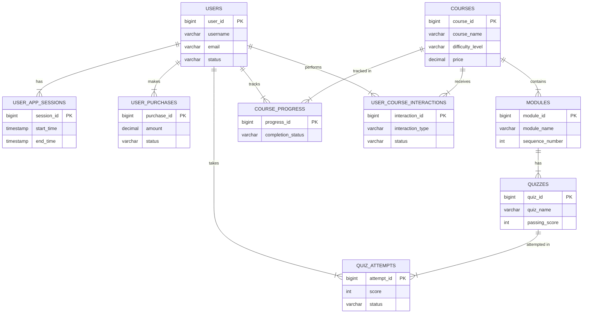

## Problem 1: Comprehensive User Behavior Tracking System

### 1. Collecting the Right Data for Analysis
We gather key data to track user behaviors, structured in the ER diagram. Here's how the data flows:

- **User Registration & Status** (`USERS` table): Tracks user activity—install/uninstall and last seen.
- **Course Interactions** (`USER_COURSE_INTERACTIONS` table): Logs course clicks, wishlist/cart additions, purchase attempts, and progress.
- **Session Tracking** (`USER_APP_SESSIONS` table): Captures each session—app open/close, session duration, features used, and navigation history.
- **Quiz Performance** (`QUIZ_ATTEMPTS` table): Logs quiz attempts, responses, completion speed, and success rates.
- **Purchase Behavior** (`USER_PURCHASES` table): Tracks cart additions, purchase attempts, completed transactions, and payment status.

By organizing data like user details, course activities, and purchases, we can analyze behaviors to enhance user experience and decision-making.

### 2. Steps of Execution
- **Database Creation:** SQL database with tables for users, courses, modules, and quizzes.
- **Indexes:** Implemented to enhance query performance.
- **Denormalized Views:** Created for easier visualization from normalized data.
  - Schema available in the [database.sql](database/database.sql).

- **Stored Procedures:** Utilized for data processing and metric calculations.
  - Available in the [stored_procedures.sql](database/stored_procedures.sql).
  - **Advantages:**
    - **Performance:** Speeds up execution through precompilation.
    - **Security:** Encapsulates business logic and limits direct access.
    - **Maintainability:** Easier to maintain and reuse across applications.
    - **Transaction Management:** Ensures data integrity and consistency.

### 3. Daily MIS Tracking

The Daily MIS report highlights key performance metrics for actionable insights:

- **New User Registration & Activity:**  
   - **Tracks:** New users, active users, and uninstalls.  
   - **Why it Matters:** Measures user acquisition, retention, and churn.

- **Conversion Rates:**  
   - **Formula:** (Conversions / Total Visitors) * 100  
   - **Why it Matters:** Reflects how effectively users convert into paying customers.

- **Course Clicks & Purchase Attempts:**  
   - **Tracks:** Page/Screen Views per Session  
   - **Why it Matters:** Highlights course interest and friction points in the purchase process.

- **Course Completion & User Retention:**  
   - **Formula:** ((Users at End - New Users) / Users at Start) * 100  
   - **Why it Matters:** Indicates user satisfaction and content quality.

- **Quiz Participation & Success Rates:**  
   - **Tracks:** Time on Page = Total Time / Number of Sessions  
   - **Why it Matters:** Helps refine quiz content by identifying trends in participation and performance.

- **Average Daily Time Spent:**  
   - **Tracks:** Session duration  
   - **Why it Matters:** Measures overall app engagement and usage.

- **Timing of Maximum Uninstalls & Purchases:**  
   - **Tracks:** Click-Through Rates (CTR)  
   - **Why it Matters:** Pinpoints churn and conversion touchpoints.

These metrics help guide improvements, ensuring alignment with both user needs and business outcomes.

### 4. Tools & Technologies
- **Figma:** To create company-specific, uniform reporting templates for clarity and consistency.
- **Tableau:** For interactive dashboards that provide stakeholders with insights through data visualization, using Figma templates.
Links to the Tableau and Figma templates will be added here. Meanwhile, feel free to explore my other [Tableau Dashboards](https://public.tableau.com/views/MintClassicCompany/F_Warehouses?:language=en-US&:sid=&:redirect=auth&:display_count=n&:origin=viz_share_link).

### 5. Data-Driven Suggestions

- **New User Registration & Activity**  
   - **New User Onboarding:** Provide guided tours, tutorials, or introductory offers to enhance the experience for new users.  
   - **Retention Campaigns:** Implement strategies like personalized emails or loyalty programs to encourage returning users to engage more frequently.

- **Course Purchase - Conversion Rate**  
   - **Streamlined Checkout Process:** Simplify the purchase or sign-up process to reduce friction and make it easier for users to complete desired actions.  
   - **Compelling Call-to-Actions:** Use persuasive and clear CTAs to prompt users toward desired conversion points.  
   - **A/B Testing and Optimization:** Continuously test and improve landing pages, content, and CTAs to drive higher conversions.

- **Course Clicks & Purchase Attempts**  
   - **Content Relevance and Accessibility:** Ensure easy access to relevant content or products based on past user activity.  
   - **Clear Navigation Paths:** Simplify navigation and suggest related courses to encourage deeper exploration.  
   - **Visual Engagement:** Use appealing visuals and clear call-to-action prompts to guide users across pages and enhance session engagement.

- **Course Completion & User Retention**  
   - **Consistent Communication:** Engage users through newsletters, personalized emails, or notifications to keep the platform top-of-mind.  
   - **Enhanced Customer Support:** Provide responsive and helpful customer service to address user concerns and foster a positive experience.  
   - **Tailored Rewards and Incentives:** Offer loyalty rewards or exclusive deals to foster appreciation and encourage continued engagement.

- **Quiz Participation**  
   - **Engaging Content Formats:** Use multimedia or interactive elements to captivate users and encourage prolonged engagement.  
   - **Internal Linking:** Recommend related content or courses to entice users to explore further within the platform.  
   - **Clear and Structured Content:** Organize content in a way that's easy to digest, keeping users engaged and interested.

In addition, I’ve been promoting financial literacy with NISM and have participated in SEBI national-level competitions in Mumbai. Here's my [resume](https://drive.google.com/file/d/1yyNwcVv1eiETabK3F5CyGD7BCjRqYDXU/view?usp=sharing).
